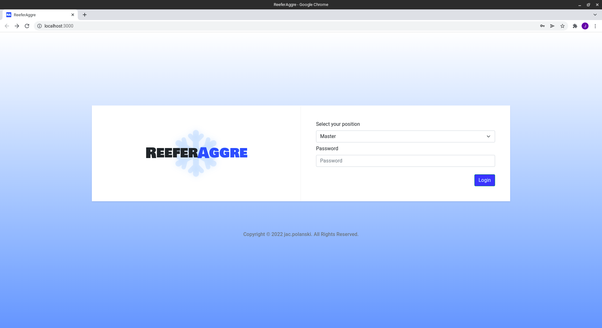
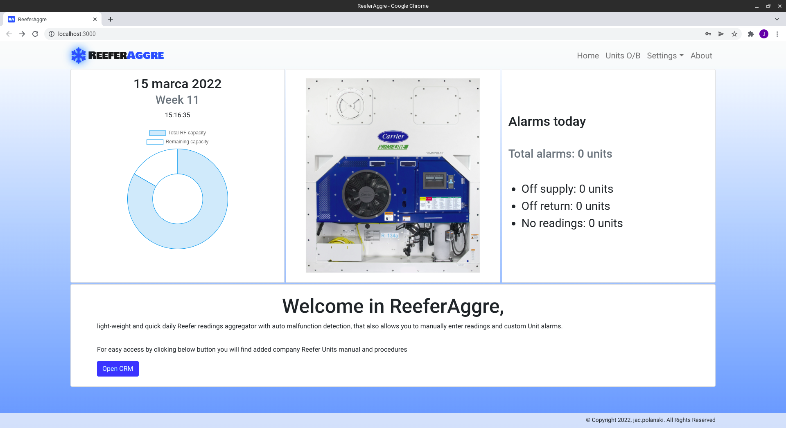
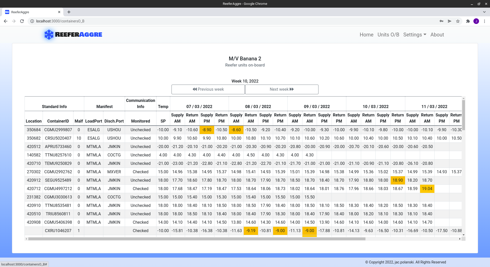
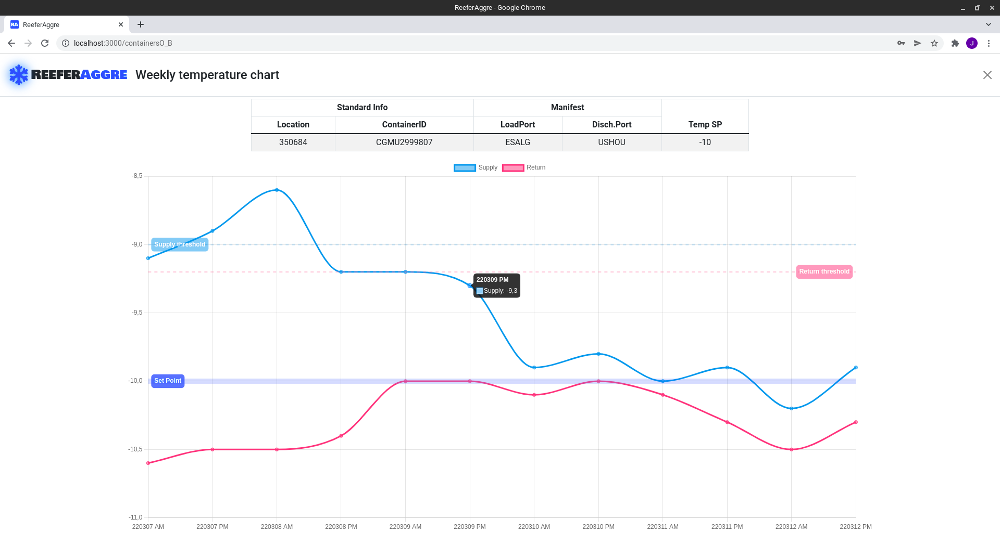
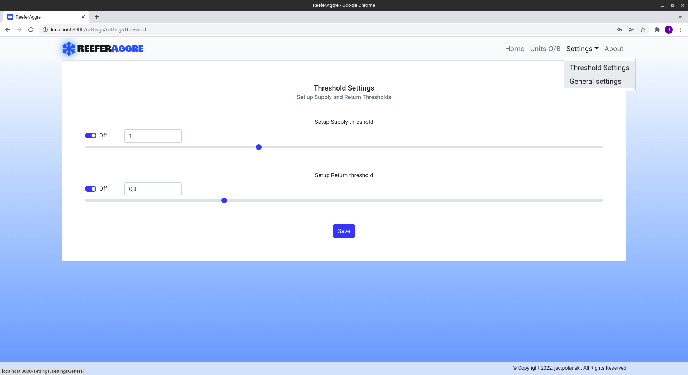
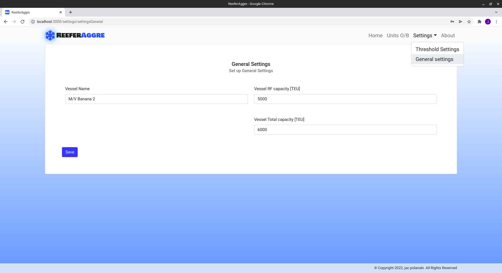

# ReeferAggre

> Final project created at end of CodersLab bootcamp. It is a light-weight and quick daily Reefer readings aggregator with auto malfunction detection, that also allows you to manually enter readings and custom Unit alarms.
> Live demo not yet available (there is a necessity to create fake database adding "daily" readings). Current version operates on real data generated onboard of vessel, parsed by `./runner/parseFiles.js`

## Table of Contents

* [General Info](#general-information)
* [Technologies Used](#technologies-used)
* [Screenshots](#screenshots)
* [Setup](#setup)
* [Project Status](#project-status)
* [Room for Improvement](#room-for-improvement)
* [Contact](#contact)

## General Information

- project created at end of learning process of CodersLab bootcamp
- fileParser for csv daily data readings located in `./runner` creates database
- database id used to display aggregated daily readings in table, grouped in weeks
- weekly readings of container unit can be viewed with graphical chart after clicking table entry
- general and threshold settings can be changed at given cards and are stored in app
- about card givers you some basic info about author
- current database ends at Week 10 of 2022

## Technologies Used

- Next.js
- React
- React-bootstrap
- React-chart.js
- Node.js
- HTML
- SCSS
- JavaScript

## Screenshots

## Setup

- download or clone repository / `git clone repo_address`
- install dependencies / `npm install`

### To start/test file parser

- delete `./data/db.json`
- edit `package.json` and add in line 11: `"type":"module"`
- files to parse - located in `./runner/csv`
- start parser by `node ./runner/parseFiles.js`
- wait for `./data/db.json` to be created
- parser will check if there are additional files to parse in above catalogue every 5 minutes

### To start/test ReeferAggre app

- if you not perform above parsing steps then unzip `./data/db.zip` to `./data`
- if you made above changes, delete line 11 from `package.json`
- start app by `npm run dev`
- open app at starter local server by link given in terminal

#### Performing following steps without closing terminal sessions keeps parser and app both running independently.

## Project Status

Project is: _in progress_.

Room for improvement:

- database editing from customer side
- various formats exports / to *.csv, *.xlsx and others
- and plenty others as that industry and subject is huge 

## To Do:

- fake database, to simulate real time data arriving to app better

## Contact

Created by [_jac.polanski_](https://www.linkedin.com/in/polanski-jacek/) - feel free to contact me!